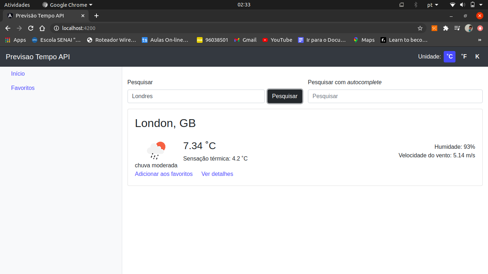

# Previsão do tempo API [Clone]

Aplicação web que tem como objetivo permitir a pesquisa de uma localidade e retornar a previsão do tempo nela, bem como detalhes e a previsão em dias conseguintes.

**OBS:** Feita juntamente com a aula e *Criando projeto para consultar a previsão do tempo via API*

## Tecnologias

* Angular
* Typescript
* Javascript
* Bootstrap
